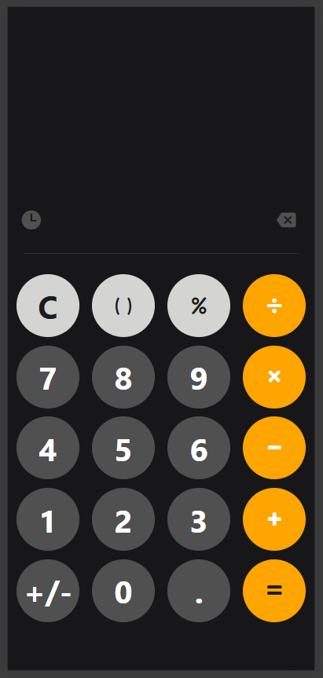
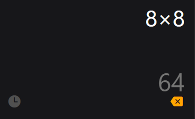
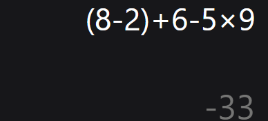
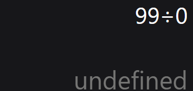
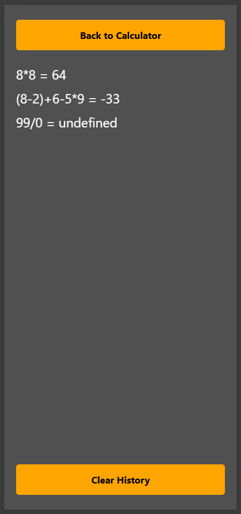

# CalculatorApp

This is a simple calculator application built using React Native and Expo. The app supports basic arithmetic operations and includes a history feature to keep track of previous calculations.

## Table of Contents

- [Installation](#installation)
- [Usage](#usage)
- [Features](#features)
- [Project Structure](#project-structure)
- [Contributing](#contributing)
- [License](#license)

## Installation

1. Clone the repository:
    ```sh
    git clone https://github.com/Hashan-Samarakkody/CalculatorApp.git
    cd CalculatorApp
    ```

2. Install the dependencies:
    ```sh
    npm install
    npm install mathjs
    ```


3. Start the Expo development server:
    ```sh
    npm start
    ```

    Or you acn run the app by using following steps:
    1) Open a terminal and navigate to the project directory.
    ```sh
    cd CalculatorApp
    ```
    2) Run the following command:
    ```sh
    expo start
    ```
    3) Select the option to start the app on an Android, iOS emulator or web browser.

        

    4) Scan the QR code with the Expo Go app on your mobile device or open the web app in a browser.


## Usage

1. Run the app on an Android or iOS emulator, or scan the QR code with the Expo Go app on your mobile device.
2. Use the calculator to perform basic arithmetic operations.
3. View the history of your calculations by pressing the "Clock" icon.

## Features

- Basic arithmetic operations: addition, subtraction, multiplication, and division.
- History feature to keep track of previous calculations.
- Responsive design for different screen sizes.
- Customizable button styles.

## Project Structure


- `App.js`: The main calculator application component.
- `components/Button.js`: The button component for the calculator app.
- `components/Row.js`: The row component for arranging buttons in a row.
- `util/History.js`: The history component for displaying previous calculations.
- `util/logic.js`: Contains the logic for the calculator operations.
- `assets/`: Contains images and icons used in the app.
- `.expo/`: Expo configuration files.
- `.vscode/`: VSCode configuration files.
- `app.json`: Expo app configuration.
- `babel.config.js`: Babel configuration file.
- `package.json`: Project dependencies and scripts.

## User Interface
* The calculator app has a responsive design that adjusts to different screen sizes. The buttons are displayed in a grid layout, and the history view is accessible through a clock icon. Also, the backspace iocn is used to delete the last character.

    

* Clculaton and answer preview,

    

* BODMAS rules,

    

* Error handling,

    

* History view,

    

## Contributing

Contributions are welcome! Please open an issue or submit a pull request for any improvements or bug fixes.

